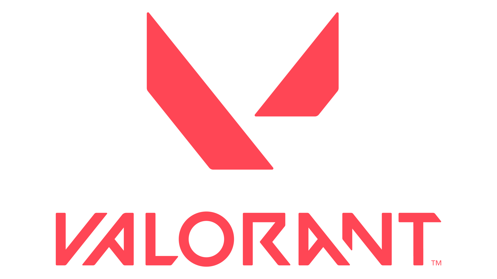

<!-- Improved compatibility of back to top link: See: https://github.com/othneildrew/Best-README-Template/pull/73 -->

<a name="readme-top"></a>

<!--
*** Thanks for checking out the Best-README-Template. If you have a suggestion
*** that would make this better, please fork the repo and create a pull request
*** or simply open an issue with the tag "enhancement".
*** Don't forget to give the project a star!
*** Thanks again! Now go create something AMAZING! :D
-->

<!-- PROJECT SHIELDS -->
<!--
*** I'm using markdown "reference style" links for readability.
*** Reference links are enclosed in brackets [ ] instead of parentheses ( ).
*** See the bottom of this document for the declaration of the reference variables
*** for contributors-url, forks-url, etc. This is an optional, concise syntax you may use.
*** https://www.markdownguide.org/basic-syntax/#reference-style-links
-->

[![LinkedIn][linkedin-shield]][linkedin-url]

<!-- PROJECT LOGO -->
<br />
<div align="center">
  <a href="https://github.com/Abi-Liu/Valorant-Team-Finder">
    
  </a>

<h3 align="center">Valorant Team Finder</h3>

  <p align="center">
    Valorant Team Finder is a passion project that I decided to make because I couldn't find anywhere to matchmake with folks when playing solo.
    <br />
    It is a full-stack application where users can create an account and find teammates to queue with in the popular FPS game, Valorant. Users will have customized profiles showcasing their rank as well as tracking their statistics from their 5 most recent games so        users can see how they've been doing in their matches, as well as a review system to rate their experiences playing with that user. They can then join or create a team with other online users.
    <br />
    <br />
    <a href="https://valorantfinder.netlify.app/">View Demo</a>
 
  </p>
</div>

<!-- TABLE OF CONTENTS -->
<details>
  <summary>Table of Contents</summary>
  <ol>
    <li>
      <a href="#about-the-project">About The Project</a>
      <ul>
        <li><a href="#built-with">Built With</a></li>
      </ul>
    </li>
    <li>
      <a href = "#how-its-made">How It's Made</a>
    </li>
    <li>
      <a href="#getting-started">Getting Started</a>
      <ul>
        <li><a href="#prerequisites">Prerequisites</a></li>
        <li><a href="#installation">Installation</a></li>
      </ul>
    </li>
    <li><a href="#usage">Usage</a></li>
    <li><a href="#license">License</a></li>
    <li><a href="#contact">Contact</a></li>
    <li><a href="#acknowledgments">Acknowledgments</a></li>
  </ol>
</details>

<!-- ABOUT THE PROJECT -->

## About The Project

[![Product Name Screen Shot][product-screenshot]](https://example.com)

<p align="right">(<a href="#readme-top">back to top</a>)</p>

### Built With

- [![typescript][typescript]][typescript-url]
- [![React][react.js]][react-url]
- [![Node][node.js]][node-url]
- [![express][express]][express-url]
- [![mongodb][mongodb]][mongodb-url]
- [![material][material]][material-url]
- [![jest][jest]][jest-url]

<p align="right">(<a href="#readme-top">back to top</a>)</p>

<!-- HOW ITS MADE -->

## How Its Made

This is my first project dabbling in Typescript, and one of the main reasons why I made this project was to dip my toes into Typescript and learn something new. Almost immediately I ran into issues. It took me a few days to even get the project set up in Typescript, and once I did, I was getting eslint errors everywhere and it just felt like there were so many new things like type declaration packages, interfaces, typing for things like errors, react components, and even api responses, it was all just a bit overwhelming. However, I stuck to it and eventually everything started to click.

A large part of this app is statistics tracking, and keeping the data needed fresh. Which introduced the first big problem I had: How should I efficiently store and update the data?
My first thought was just to fetch the users data from the Valorant API whenever someone went to that users profile. However, this solution turned out to be a bit slow and inefficient as it lead to long load times for the end user. The next idea I came up with was a cron job to automatically updated the match history data every few hours in order to ensure the latest matches are loaded. However if my user base got too big, then this would lead to a massive strain on both my server, as well as the third party API server I'm using as I would need to update the matches for every single one of my users in my database. The solution I came up with was to combine both solutions. The idea is to get the match history data and store it into the database with a "fresh time", i.e one or two hours after its original fetch date. If a user tries to go to a profile _before_ the data is "stale", it serves the data directly from the DB, however, if the user requests the data _after_ the stale time, the server will refetch that data from the third party API. This combines both the previous methods and caches the data while maintaing the most recent match history data at the same time.

Another educational and practical step I took was to implement unit testing for my endpoints with Jest and Supertest. This allowed me to test my endpoints as I built them to ensure everything was functioning as expected when it came time to build out my UI. This saved a lot of headache and switching back and forth between my code and Postman or building out my UI and then realizing that some endpoints didn't work as expected.

Another big learning moment during this project was how to keep code DRY. Because of the way my controllers were set up, I found myself repeating the same long snippet of code whenever I wanted to fetch the match data and to check if the current version in the database was stale. So I ended up creating a new file that I would import into wherever I needed the code in order to make my code more readable as well as reusable. This really helped keep my code cleaner and less lengthy.

This project really helped me hone my frontend skills as well as I really went all out to try to make things as visually appealing and easy to use as I could. I had a chat with a great developer and he gave me a piece of advice that really changed my mindset on the way I designed things. He told me to not think of everything in terms of code, but instead really try to hone in on the product level design and to make the app functional as well as visually appealing. He also taught me to really mess around in the Dev tools to quickly build out a prototype of the UI and to wireframe the layout before focusing solely on the code. With that advice in mind, I'm really proud of what I've created UI wise. It's functional and easy to use on all screensizes, and looks visually appealing as well, at least in my opinion.

<p align="right">(<a href="#readme-top">back to top</a>)</p>

<!-- GETTING STARTED -->

## Getting Started

To get a local copy up and running follow these simple example steps.

### Prerequisites

This project requires you to have NPM installed. If you don't, you can do so by entering this command in your terminal

- npm
  ```sh
  npm install npm@latest -g
  ```

### Installation

1. Clone the repo
   ```sh
   git clone https://github.com/Abi-Liu/Valorant-Team-Finder.git
   ```
2. Install NPM packages in both the client and server folders
   ```sh
   cd client
   npm install
   ```
   ```sh
   cd backend
   npm install
   ```
3. Create a `.env` file in the root of the backend folder, and enter a PORT variable, Database connection variable, as well as a session secret variable
   ```md
   PORT = 8000;
   DB_STRING = "YOUR_DB_URI";
   SESSION_SECRET = YOUR_SECRET
   ```

<p align="right">(<a href="#readme-top">back to top</a>)</p>

<!-- USAGE EXAMPLES -->

## Usage

To use, start the server by navigating to the backend folder and running

```sh
cd backend
npm start
```

Once the server is running, navigate to the client folder and use the command

```sh
 cd client
 npm run dev
```

Once the servers are up and running, you will be free to use the app and all of it's features. Just register your account and be sure to use a _VALID RIOT ID_ or else the app will not work. It is dependant on that to be able to actually fetch all of the details that are unique to you, such as your banner card, rank, match history, and etc.

_Note: To run locally, you will need to change the urls in the project to your localhost port numbers. An easy way of doing this is to search for all instances of `valorantfinder` and change it to your respective localhost port._

<p align="right">(<a href="#readme-top">back to top</a>)</p>

<!-- LICENSE -->

## License

Distributed under the MIT License.

<p align="right">(<a href="#readme-top">back to top</a>)</p>

<!-- CONTACT -->

## Contact

Abi Liu - abiliu018@gmail.com

Project Link: [https://github.com/Abi-Liu/Valorant-Team-Finder](https://github.com/Abi-Liu/Valorant-Team-Finder)

<p align="right">(<a href="#readme-top">back to top</a>)</p>

<!-- ACKNOWLEDGMENTS -->

## Acknowledgments

I would like to give a special thanks to these resources that really helped me make this project

- [Valorant API](https://github.com/Henrik-3/unofficial-valorant-api)
- [Valorant Assets File](<https://www.figma.com/file/yeusbXGVd3uaeZetmzFavP/VALORANT-Graphic-Assets-(Community)?type=design&node-id=106-124&mode=design&t=UCzXgjLqZPLs54rK-0>)

<p align="right">(<a href="#readme-top">back to top</a>)</p>

<!-- MARKDOWN LINKS & IMAGES -->
<!-- https://www.markdownguide.org/basic-syntax/#reference-style-links -->

[contributors-shield]: https://img.shields.io/github/contributors/Abi-Liu/Valorant-Team-Finder.svg?style=for-the-badge
[contributors-url]: https://github.com/Abi-Liu/Valorant-Team-Finder/graphs/contributors
[forks-shield]: https://img.shields.io/github/forks/Abi-Liu/Valorant-Team-Finder.svg?style=for-the-badge
[forks-url]: https://github.com/Abi-Liu/Valorant-Team-Finder/network/members
[stars-shield]: https://img.shields.io/github/stars/Abi-Liu/Valorant-Team-Finder.svg?style=for-the-badge
[stars-url]: https://github.com/Abi-Liu/Valorant-Team-Finder/stargazers
[issues-shield]: https://img.shields.io/github/issues/Abi-Liu/Valorant-Team-Finder.svg?style=for-the-badge
[issues-url]: https://github.com/Abi-Liu/Valorant-Team-Finder/issues
[license-shield]: https://img.shields.io/github/license/Abi-Liu/Valorant-Team-Finder.svg?style=for-the-badge
[license-url]: https://github.com/Abi-Liu/Valorant-Team-Finder/blob/master/LICENSE.txt
[linkedin-shield]: https://img.shields.io/badge/-LinkedIn-black.svg?style=for-the-badge&logo=linkedin&colorB=555
[linkedin-url]: https://linkedin.com/in/abiliu
[product-screenshot]: images/screenshot.png
[React.js]: https://img.shields.io/badge/React-20232A?style=for-the-badge&logo=react&logoColor=61DAFB
[React-url]: https://reactjs.org/
[node.js]: https://img.shields.io/badge/Node.js-43853D?style=for-the-badge&logo=node.js&logoColor=white
[node-url]: https://nodejs.org/en
[express]: https://img.shields.io/badge/Express.js-404D59?style=for-the-badge
[express-url]: https://expressjs.com/
[mongodb]: https://img.shields.io/badge/MongoDB-4EA94B?style=for-the-badge&logo=mongodb&logoColor=white
[mongodb-url]: https://www.mongodb.com/
[material]: https://img.shields.io/badge/Material--UI-0081CB?style=for-the-badge&logo=material-ui&logoColor=white
[material-url]: https://mui.com/
[typescript]: https://img.shields.io/badge/TypeScript-007ACC?style=for-the-badge&logo=typescript&logoColor=white
[typescript-url]: https://www.typescriptlang.org/
[jest]: https://img.shields.io/badge/Jest-323330?style=for-the-badge&logo=Jest&logoColor=white
[jest-url]: https://jestjs.io/
